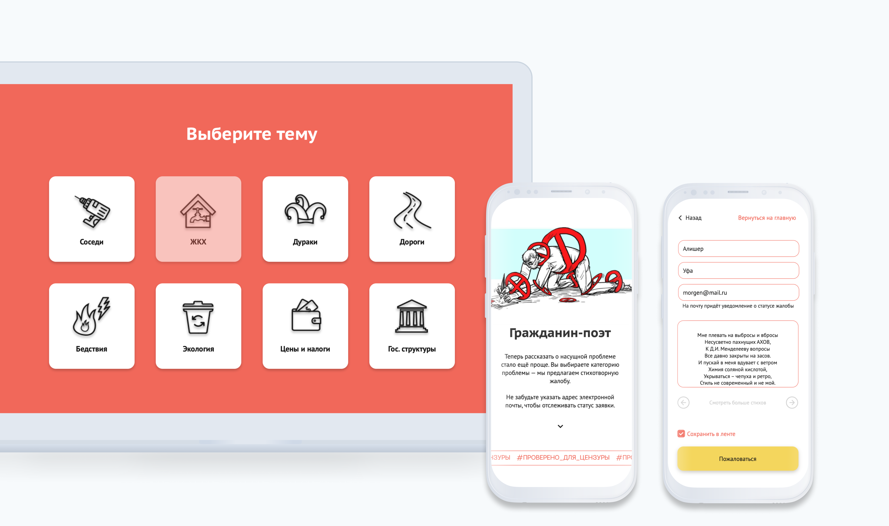

# Хакатон "Гражданин-поэт 2025"
[Ссылка на GitHub Pages](https://lenapronina.github.io/civil-poetry/) </br>
[Ссылка на дизайн-проект в Figma](https://www.figma.com/file/1PXP2nw7y2ALTiWiBp2w0L/%D0%A5%D0%B0%D0%BA%D0%B0%D1%82%D0%BE%D0%BD-%C2%AB%D0%93%D1%80%D0%B0%D0%B6%D0%B4%D0%B0%D0%BD%D0%B8%D0%BD-%D0%BF%D0%BE%D1%8D%D1%82-2025%C2%BB?node-id=285%3A100)



## О проекте
На дворе 2025 год, цензура проросла во все сферы нашей жизни. Теперь подать жалобу на соседа-дебошира и протекающий кран можно, лишь используя ямб и амфибрахий: обращения граждан должны быть написаны стихами поэтов-классиков!
Подобрать нужные слова поможет веб-приложение Гражданин-поэт 2025; используя уже сформированные категории и характер вашей жалобы, вы можете подобрать необходимое вам стихотворение и оформить заявку.

Проект выполнен в рамках двухнедельного хакатона студентов факультета дизайна и веб-разработки [Яндекс.Практикума](https://praktikum.yandex.ru/).

**Дизайнер:**
* Анастасия Московская

**Разработчики:**
* [Лена Пронина](https://github.com/lenapronina/)
* [Айгуль Альмухаметова](https://github.com/Sseverniy)
* [Ингрида Федаравичюте](https://github.com/infeda/)

### Функциональность
Приложение написано на JS с использованием классов. Верстка реализована по принципу mobile first. Информация о жалобах хранится в базе данных Mongo, бэкенд развернут при помощи сервсиов Strapi и Heroku.

### Запуск проекта

Перед стартом убедитесь, что у вас установлен node.

1. Склонировать репозиторий
  ```
  git clone https://github.com/lenapronina/civil-poetry.git
  ```
2. Перейти в директорию с проектом
  ```
  cd civil-poetry
  ```
3. Установить зависимости
  ```
  npm install
  ```
4. Запустить приложение  
  ```
  npm run dev
  ```
5. Собрать оптимизированный build
  ```
  npm run build
  ```
6. Публикация на gh-pages с ссылкой на homepage
  ```
  npm run deploy
  ```

### Используемые технологии

HTML · CSS · BEM · JS · git · githubPages · Webpack · npm · Strapi · MongoDB · Heroku 


### Добработки
1. Рефакторинг на основе ревью
2. Доработать верстку для десктоп версии
